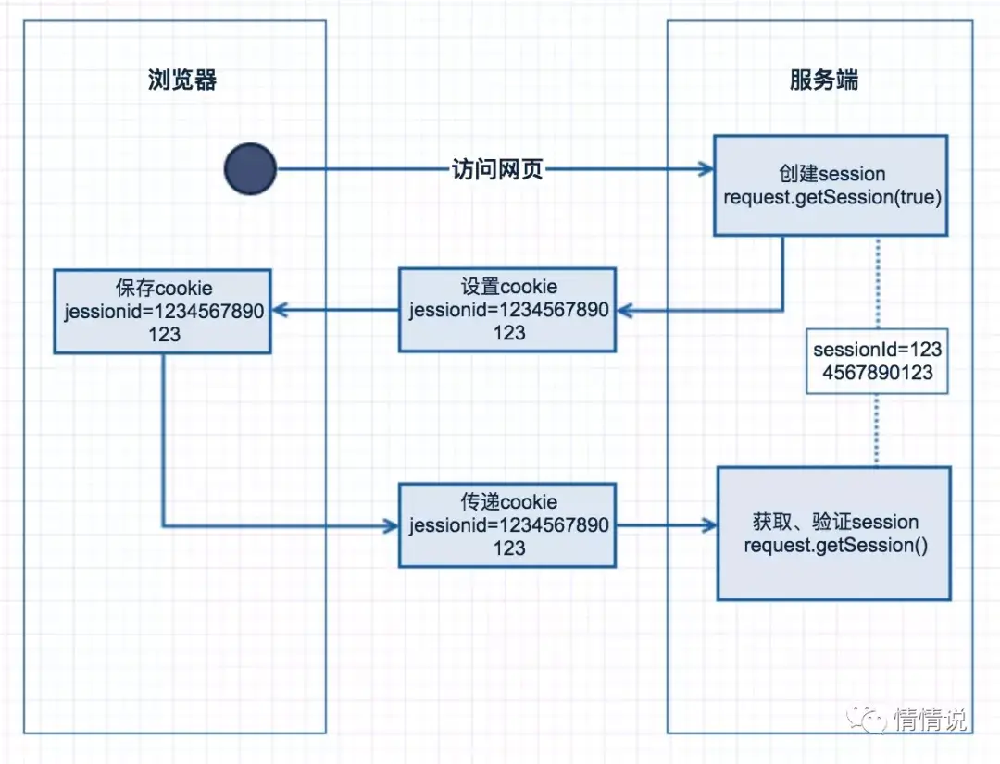

# cookie 认证

HTTP Cookie（也叫 Web Cookie 或浏览器 Cookie）是服务器发送到用户浏览器并保存在本地的一小块数据，它会在浏览器下次向同一服务器再发起请求时被携带并发送到服务器上。通常，它用于告知服务端两个请求是否来自同一浏览器，如保持用户的登录状态。Cookie 使基于无状态的 HTTP 协议记录稳定的状态信息成为了可能。

Cookie 主要用于以下三个方面：

会话状态管理（如用户登录状态、购物车、游戏分数或其它需要记录的信息）
个性化设置（如用户自定义设置、主题等）
浏览器行为跟踪（如跟踪分析用户行为等）
Cookie 曾一度用于客户端数据的存储，因当时并没有其它合适的存储办法而作为唯一的存储手段，但现在随着现代浏览器开始支持各种各样的存储方式，Cookie 渐渐被淘汰。由于服务器指定 Cookie 后，浏览器的每次请求都会携带 Cookie 数据，会带来额外的性能开销（尤其是在移动环境下）。新的浏览器 API 已经允许开发者直接将数据存储到本地，如使用 Web storage API （本地存储和会话存储）或 IndexedDB 。

### cookie 产生整个交互过程



使用浏览器访问服务端页面；

- 服务端收到该客户端第一次请求后，会创建一个 session ，生产一个唯一 sessionId ；
- 同时在响应请求中设置 cookie ，属性名为 jessionid；
- 客户端收到后会保存 jessionid ，再次请求时，会在 header 中设置，服务端可从请求头中获取；
- 服务端验证获取的 sessionId 是否存在，即可验证是否是同一用户；
- 当浏览器禁用 cookie 后，基于 cookie 的 session 将不能正常工作，每次都将创建一个新的 session ，可通过 url 重写传递 sessionid。

## 创建 cookie

当服务器收到 HTTP 请求时，服务器可以在响应头里面添加一个 Set-Cookie 选项。浏览器收到响应后通常会保存下 Cookie，之后对该服务器每一次请求中都通过 Cookie 请求头部将 Cookie 信息发送给服务器。另外，Cookie 的过期时间、域、路径、有效期、适用站点都可以根据需要来指定。

Set-Cookie 响应头部和 Cookie 请求头部
服务器使用 Set-Cookie 响应头部向用户代理（一般是浏览器）发送 Cookie 信息。一个简单的 Cookie 可能像这样：

```
Set-Cookie: <cookie 名>=<cookie 值>
```

服务器通过该头部告知客户端保存 Cookie 信息。

```
HTTP/1.0 200 OK
Content-type: text/html
Set-Cookie: yummy_cookie=choco
Set-Cookie: tasty_cookie=strawberry
[页面内容]
```

现在，对该服务器发起的每一次新请求，浏览器都会将之前保存的 Cookie 信息通过 Cookie 请求头部再发送给服务器。

```
GET /sample_page.html HTTP/1.1
Host: www.example.org
Cookie: yummy_cookie=choco; tasty_cookie=strawberry
```

## cookie 属性

| Property | Type                                                              | Description                                                                                 |
| -------- | ----------------------------------------------------------------- | ------------------------------------------------------------------------------------------- |
| domain   | String                                                            | Domain name for the cookie. Defaults to the domain name of the app.                         |
| encode   | Function                                                          | A synchronous function used for cookie value encoding. Defaults to encodeURIComponent.      |
| expires  | Date                                                              | Expiry date of the cookie in GMT. If not specified or set to 0, creates a session cookie.   |
| httpOnly | Boolean Flags the cookie to be accessible only by the web server. |
| maxAge   | Number                                                            | Convenient option for setting the expiry time relative to the current time in milliseconds. |
| path     | String                                                            | Path for the cookie. Defaults to “/”.                                                       |
| secure   | Boolean                                                           | Marks the cookie to be used with HTTPS only.                                                |
| signed   | Boolean                                                           | Indicates if the cookie should be signed.                                                   |
| sameSite | Boolean                                                           | or String Value of the “SameSite” Set-Cookie attribute.                                     |

基于 cookie 的认证方式也有很多缺点：

- cookie 是存储在客户端的，所以在一定程度上增加了可以伪造的几率，安全性上稍微弱一点。
- 由于 cookie 在浏览中有跨域的阻拦，所以在有跨域需求的时候，需要服务器做相应的配置。
- cookie 是有长度限制的，所以不宜存储过长的信息。
- 用户的客户端可能会禁用 cookie，这个时候可以依靠 url 传值来解决这个问题。
- 服务端想要操作 cookie 认证信息的失效，比较困难，不像 session 认证那样方便。

**参考资料**

[http://expressjs.com/en/5x/api.html#res.cookie](http://expressjs.com/en/5x/api.html#res.cookie)

[https://sxd.vercel.app/http/cookie.html](https://sxd.vercel.app/http/cookie.html)

[https://tools.ietf.org/html/draft-ietf-httpbis-cookie-same-site-00#section-4.1.1](https://tools.ietf.org/html/draft-ietf-httpbis-cookie-same-site-00#section-4.1.1)

[https://developer.mozilla.org/zh-CN/docs/Web/HTTP/Cookies](https://developer.mozilla.org/zh-CN/docs/Web/HTTP/Cookies)
