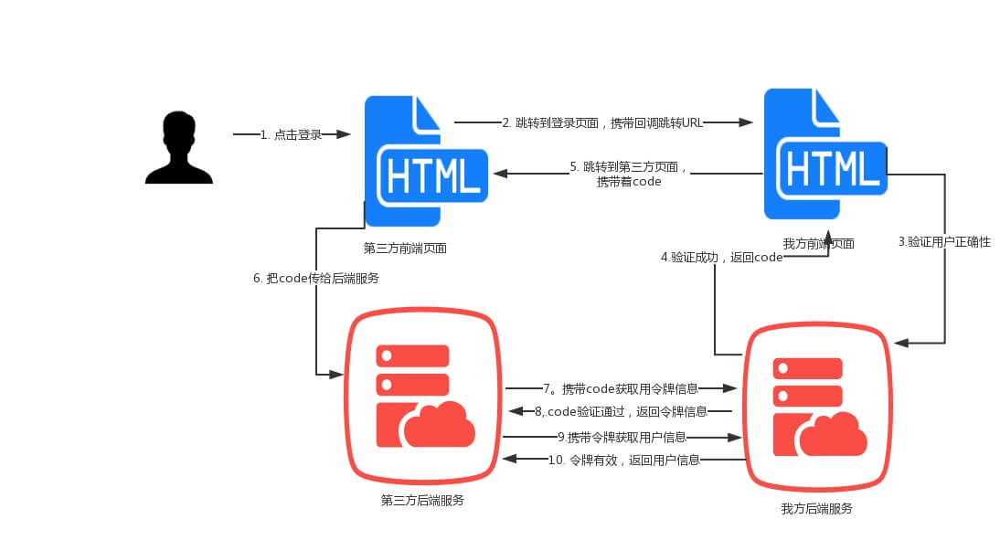

# oAuth2.0

OAuth 协议，是一种授权协议，不涉及具体的代码，只是表示一种约定的流程和规范。
OAuth 协议一般用于用户决定是否把自己在某个服务商上面的资源（比如：用户基本资料、照片、视频等）授权给第三方应用访问。此外，OAuth2.0 协议是 OAuth 协议的升级版，现在已经逐渐成为单点登录（SSO）和用户授权的标准。

**本示例是以 github 的三方认证为例子。**

## 基本授权流程



简单的讲，就是你的先去第三方 申请注册下面三个东西:

```
const client_id = "xx";
const client_secret = "xx";
const redirect_uri = "http://127.0.0.1:3009/users/oauth";
```

用户在页面点击登录后，后端会拿着上面这三样东西，拼接一个地址，跳转到第三方，第三方校验 client_id、client_secret、redirect_uri，通过后第三方回调 redirect_uri，在 url 后面带上 token, 拿着 token 和 client_secret，去第三方获取 access_token， 然后系统就可以拿着 access_token 去第三方获取用户信息。

## demo

[cookie 认证示例](../oauth2.0)

**参考资料**

[http://www.ruanyifeng.com/blog/2014/05/oauth_2_0.html](http://www.ruanyifeng.com/blog/2014/05/oauth_2_0.html)
