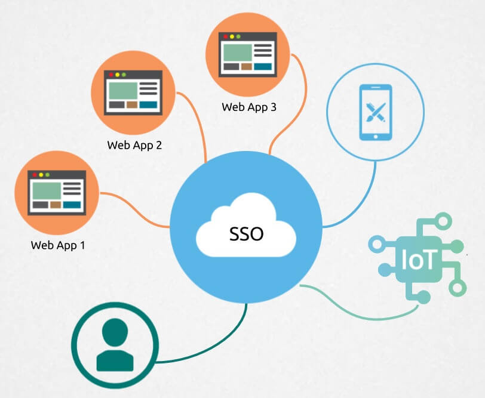
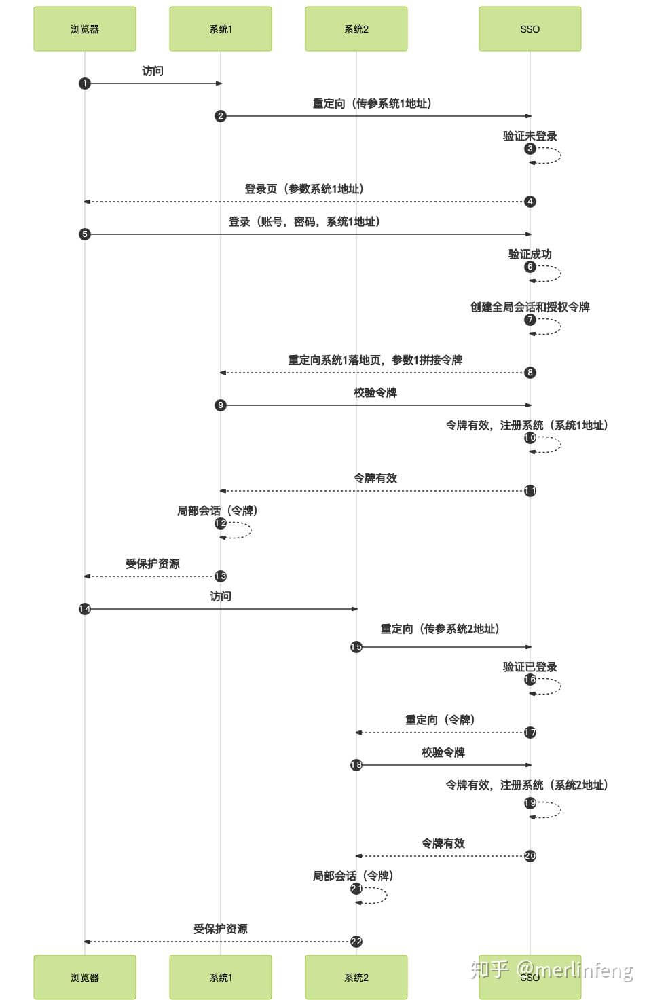

# sso 单点登录

### 概念

单点登录（Single Sign On），简称为 SSO，是比较流行的企业业务整合的解决方案之一。SSO 的定义是在多个应用系统中，用户只需要登录一次就可以访问所有相互信任的应用系统。

### 背景

企业发展初期，系统设计不多，可能只有一个系统就可以满足业务需求，用户也只需要用账号和密码登录即可完成认证。但是随着业务的迭代发展，系统架构会随之迭代，演变越来越多的子系统，用户每进入一个系统可能都需要登录一次，才能进行相关操作。为解决此问题，便产生了单点登录，即在一个多系统共存的环境下，用户在一处登录后，就不用在其他系统中登录，就得到其他所有系统的信任。

### 单系统登录

访问一个需要登录的应用时主要发生的一系列流程，如下图所示：

登录后设置的 Cookie，之后每次访问时都会携带该 Cookie，服务端会根据这个 Cookie 找到对应的 session，通过 session 来判断这个用户是否登录。如果不做特殊配置，这个 Cookie 的名字叫做 sessionid，值在服务端（server）是唯一的，也可以设置一个 token，作为用户唯一标识，从而让后台服务能识别当前登录用户。Cookie 过期重新登录，如果是同域下系统登录，依旧可以使用此方式进行登录。

### 设计与实现

单点登录的本质就是在多个应用系统中共享登录状态。

如果用户的登录状态是记录在 Session 中的，要实现共享登录状态，就要先共享 Session，比如可以将 Session 序列化到 Redis 中，让多个应用系统共享同一个 Redis，直接读取 Redis 来获取 Session。当然仅此是不够的，因为不同的应用系统有着不同的域名，尽管 Session 共享了，但是由于 Session ID 是往往保存在浏览器 Cookie 中的，因此存在作用域的限制，无法跨域名传递，也就是说当用户在 http://app1.com 中登录后，Session ID 仅在浏览器访问 http://app1.com 时才会自动在请求头中携带，而当浏览器访问 http://app2.com 时，Session ID 是不会被带过去的。「实现单点登录的关键在于，如何让 Session ID（或 Token）在多个域中共享。」

#### 基于 COOKIE 实现

#### 同域名

一个企业一般情况下只有一个域名，通过二级域名区分不同的系统。比如我们有个域名叫做：http://a.com，同时有两个业务系统分别为：http://app1.a.com和http://app2.a.com。我们要做单点登录（SSO），需要一个登录系统，叫做：http://sso.a.com。

我们只要在http://sso.a.com登录，http://app1.a.com和http://app2.a.com就也登录了。通过上面的登陆认证机制，我们可以知道，在http://sso.a.com中登录了，其实是在http://sso.a.com的服务端的session中记录了登录状态，同时在浏览器端（Browser）的http://sso.a.com下写入了Cookie。那么我们怎么才能让http://app1.a.com和http://app2.a.com登录呢？

Cookie 是不能跨域的，我们 Cookie 的 domain 属性是http://sso.a.com，在给http://app1.a.com和http://app2.a.com发送请求是带不上的。sso登录以后，可以将Cookie的域设置为顶域，即.http://a.com，这样所有子域的系统都可以访问到顶域的Cookie。

「我们在设置 Cookie 时，只能设置顶域和自己的域，不能设置其他的域。比如：我们不能在自己的系统中给http://baidu.com的域设置Cookie。」

总结：此种实现方式比较简单，但不支持跨主域名。

#### 不同域名

上面列举的例子是针对相同域名，但是当顶级域名不相同的时候，如天猫和淘宝，如何实现 cookie 共享呢？

#### nginx 反向代理

「反向代理（Reverse Proxy」方式是指以代理服务器来接受 Internet 上的连接请求，然后将请求转发给内部网络上的服务器；并将从服务器上得到的结果返回给 Internet 上请求连接的客户端，此时代理服务器对外就表现为一个服务器。

反向代理服务器对于客户端而言它就像是原始服务器，并且客户端不需要进行任何特别的设置。客户端向反向代理 的命名空间(name-space)中的内容发送普通请求，接着反向代理将判断向何处(原始服务器)转交请求，并将获得的内容返回给客户端，就像这些内容 原本就是它自己的一样。

### 认证中心

基于 cookie 方式实现单点登录，存在安全隐患，另外可能还要解决跨域问题，对于此，可以部署一个「认证中心」，认证中心就是一个专门负责处理登录请求的独立的 Web 服务。

只有认证中心能接受用户的用户名密码等安全信息，其他系统不提供登录入口，只接受认证中心的间接授权。间接授权通过令牌实现，sso 认证中心验证用户的用户名密码没问题，创建授权令牌，在接下来的跳转过程中，授权令牌作为参数发送给各个子系统，子系统拿到令牌，即得到了授权，可以借此创建局部会话，局部会话登录方式与单系统的登录方式相同。

下面对上图简要描述

- 用户访问系统 1 的受保护资源，系统 1 发现用户未登录，跳转至 sso 认证中心，并将自己的地址作为参数
- sso 认证中心发现用户未登录，将用户引导至登录页面
- 用户输入用户名密码提交登录申请
- sso 认证中心校验用户信息，创建用户与 sso 认证中心之间的会话，称为全局会话，同时创建授权令牌
- sso 认证中心带着令牌重定向最初的请求地址（系统 1）
- 系统 1 拿到令牌，去 sso 认证中心校验令牌是否有效
- sso 认证中心校验令牌，返回有效，注册系统 1
- 系统 1 使用该令牌创建与用户的会话，key 为用户字段，值为 token，称为局部会话，返回受保护资源
- 用户访问系统 2 的受保护资源
- 系统 2 发现用户未登录，重定向 sso 认证中心，并将自己的地址作为参数
- sso 认证中心发现用户已登录，跳转回系统 2 的地址，并附上令牌
- 系统 2 拿到令牌，去 sso 认证中心校验令牌是否有效
- sso 认证中心校验令牌，返回有效，注册系统 2
- 系统 2 使用该令牌创建与用户的局部会话，返回受保护资源

用户登录成功之后，会与 sso 认证中心及各个子系统建立会话，用户与 sso 认证中心建立的会话称为全局会话，用户与各个子系统建立的会话称为局部会话，局部会话建立之后，用户访问子系统受保护资源将不再通过 sso 认证中心，全局会话与局部会话有如下约束关系

- 局部会话存在，全局会话一定存在
- 全局会话存在，局部会话不一定存在
- 全局会话销毁，局部会话必须销毁

**参考资料**

[https://zhuanlan.zhihu.com/p/334720992](https://zhuanlan.zhihu.com/p/334720992)
